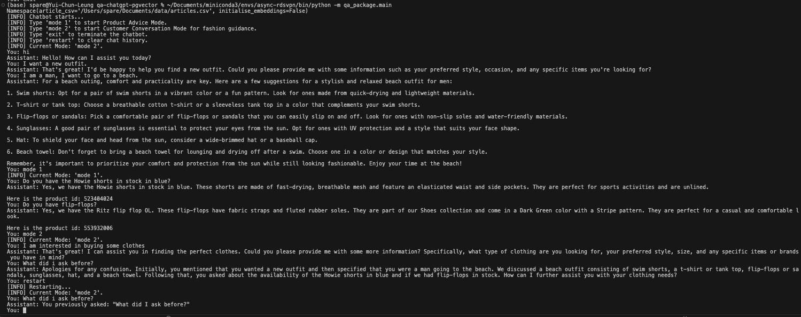

# qa-chatgpt-pgvector



## Schedule (8-9 Nov)
1. docker-compose.yml + Dockerfile.pgvector
    - initialise a database with vector support.
1. test-openai.ipynb
    - test openai==1.1.1 api, including embeddings and chat completions.
2. create-embeddings.ipynb
    - create embeddings for all articles.
    - discover 3 nan details in record.
    - store embeddings in postgres using pgvector.
3. doc-search.ipynb
    - prove that pgvector can help cosine similiarity calculation.
    - only embedding details from dataframe are not enough as answers can be inaccurate.
    - try question-answering with given information.
4. chatbot.ipynb
    - implement chat completion loop.
5. guardrail_openai-0-28-1.ipynb
    - try guardrails-ai.
    - switch openai version to 0.28.x as 1.1.x is not compatible with guardrails-ai.
    - try all embeddings and chat completions in 0.28.x openai api.
6. qa_package.main
    - create chatbot.

## How to run?
1. Install required packages. `pip install -e .`
2. Initialise postgres in Docker. `docker compose up --build`
3. Run chatbot. (Only run with `--initialise-embeddings` for the first time)
    ```python
    python -m qa_package.main \
    --article-csv str \
    --initialise-embeddings
    ```
    for example,
    ```
    python -m qa_package.main \
    --initialise-embeddings \
    --article-csv /Users/spare/Documents/data/articles.csv
    ```

## References
1. https://pypi.org/project/openai/0.28.1/
    - Old Documentation of openai 0.28.1
2. https://learn.microsoft.com/en-us/azure/ai-services/openai/how-to/switching-endpoints
    - openai 0.28.1 vs openai 1.1.1
3. https://www.kommunicate.io/blog/create-a-customer-service-chatbot-using-chatgpt/
    - Conversation loop for chatbot.
4. https://www.mlq.ai/fine-tuning-gpt-3-question-answer-bot/
    - Question Answering with given information.
5. https://docs.guardrailsai.com/defining_guards/pydantic/
    - Define Guardrails with Pydantic.
6. https://docs.guardrailsai.com/guardrails_ai/getting_started/#creating-a-rail-spec
    - Guardrails example.
