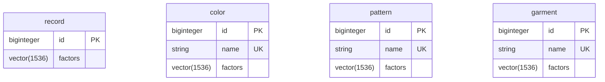
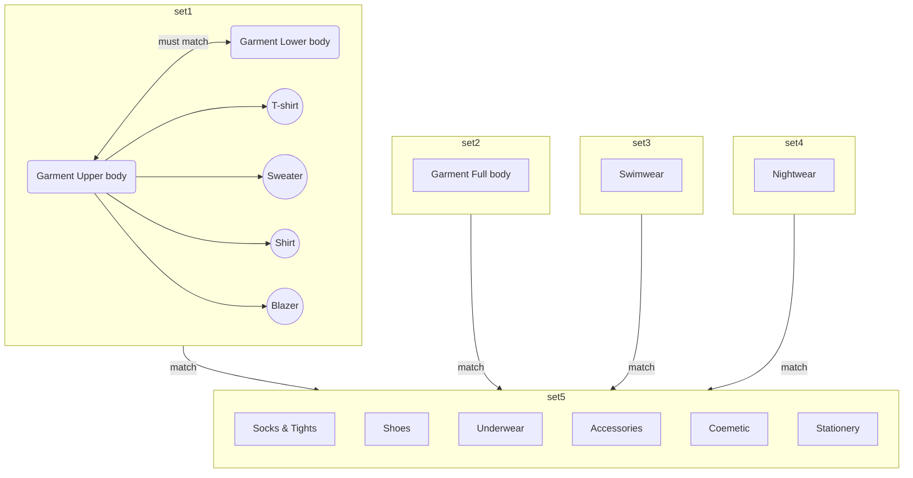

```mermaid
erDiagram
    a[record] {
        biginteger id PK
        vector(1536) factors
    }
    b[color] {
        biginteger id PK
        string name UK
        vector(1536) factors
    }
    c[pattern] {
        biginteger id PK
        string name UK
        vector(1536) factors
    }
    d[garment] {
        biginteger id PK
        string name UK
        vector(1536) factors
    }
```

```mermaid
flowchart TB
    subgraph A[set1]
        direction LR
            aa(Garment Upper body) <-->|must match| ab(Garment Lower body)
            aa --> ac((T-shirt)) & ad((Sweater)) & ae((Shirt)) & af((Blazer))
    end
    subgraph B[set2]
        direction TB
            ba[Garment Full body]
    end
    subgraph C[set3]
        direction TB
            ca[Swimwear]
    end
    subgraph D[set4]
        direction TB
            da[Nightwear]
    end
    subgraph E[set5]
        direction TB
            ea[Socks & Tights]
            eb[Shoes]
            ec[Underwear]
            ed[Accessories]
            ee[Coemetic]
            ef[Stationery]
    end
    A & B & C & D -->|match| E;

```
